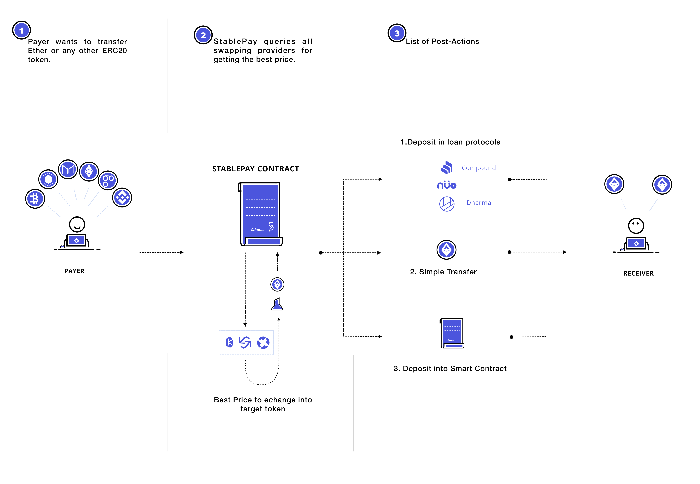

# Welcome to StablePay Documentation

### What is StablePay?

StablePay is a decentralized payment platform that enables users to make payments or donations with Ethereum or other ERC20 tokens, that get instantly converted to DAI token.

### How StablePay works?

The contracts function as a gateway for receiving tokens, seek the best rate for trading on existing decentralized exchanges\(Uniswap, Kyber\), and swap the tokens to DAI token, to finally send them over to the receiver.

For more information, you can visit our page:[https://stablepay.io/](https://stablepay.io/)

